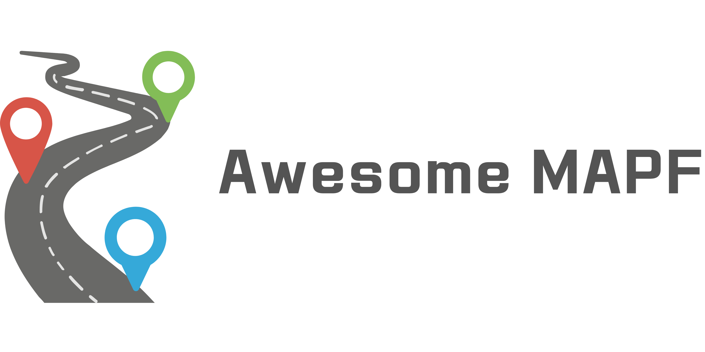

# Awesome MAPF 

> A curated list of awesome frameworks, libraries, software, and resources related to Multi Agent Path Finding (MAPF).

Welcome to the MAPF resources repository, an organized collection of valuable materials related to Multi Agent Path Finding (MAPF).

Our primary objective is to build and maintain a classified, community-driven assortment of widely recognized resources. This collection can serve as a reference point, a springboard for research, or simply as a well-curated list of resources for those interested in MAPF.

**Please note, the code shared here may not always be the official version associated with the original paper. Therefore, we strongly advise caution and thorough examination when utilizing the code for your purposes.**

Your questions, resource requests, and pull request contributions are always welcome and appreciated. Together, we can create a comprehensive and useful hub for MAPF resources!

## Contents
***
- [Papers](#papers)
- [Websites](#websites)
- [Videos](#videos)
- [Repositories](#repositories)

## Papers
***
- **Survey**
  - [Multi-Agent Path Finding – An Overview](https://www.researchgate.net/publication/336611576_Multi-Agent_Path_Finding_-_An_Overview)
  - [Multi-Agent Pathfinding: Definitions, Variants, and Benchmarks](https://arxiv.org/abs/1906.08291)
  - [Problem Compilation for Multi-Agent Path Finding: a Survey](https://www.ijcai.org/proceedings/2022/0783.pdf)
  - [Planning and Learning in Multi-Agent Path Finding](https://link.springer.com/article/10.1134/S1064562422060229)
- **Search-based Approach**
  - Cooperative Pathfinding [[1]](https://www.davidsilver.uk/wp-content/uploads/2020/03/coop-path-AIIDE.pdf) [[2]](https://www.davidsilver.uk/wp-content/uploads/2020/03/coop-path-AIWisdom.pdf) ([Code](https://github.com/yge58/collaborative_a_star_pathfinding))
  - [Conflict-based search for optimal multi-agent pathfinding](https://www.sciencedirect.com/science/article/pii/S0004370214001386?ref=pdf_download&fr=RR-2&rr=7ecc49887d32edb5) (CBS) ([Code](https://github.com/whoenig/libMultiRobotPlanning))
  - [Suboptimal Variants of the Conflict-Based Search Algorithm for the Multi-Agent Pathfinding Problem](https://ojs.aaai.org/index.php/SOCS/article/view/18315) (ECBS) ([Code](https://github.com/whoenig/libMultiRobotPlanning))
  - [EECBS: A Bounded-Suboptimal Search for Multi-Agent Path Finding](https://arxiv.org/abs/2010.01367) (EECBS) ([Code](https://github.com/Jiaoyang-Li/EECBS))
  - [ICBS: Improved Conflict-Based Search Algorithm for Multi-Agent Pathfinding](https://www.ijcai.org/Proceedings/15/Papers/110.pdf) (ICBS) ([Code](https://github.com/gloriyo/MAPF-ICBS#background))
  - [Multi-Agent Pathfinding with Continuous Time](https://www.ijcai.org/Proceedings/2019/0006.pdf) (CCBS) ([Code](https://github.com/PathPlanning/Continuous-CBS))
  - [Subdimensional expansion for multirobot path planning](https://www.sciencedirect.com/science/article/pii/S0004370214001271?ref=pdf_download&fr=RR-2&rr=7ecc4a7e48feedb5) (M*) ([Code](https://github.com/wonderren/public_cppmomapf))
  - [SIPP: Safe Interval Path Planning for Dynamic Environments](https://www.cs.cmu.edu/~maxim/files/sipp_icra11.pdf) (SIPP) ([Code](https://github.com/whoenig/libMultiRobotPlanning))
  - [Anytime Multi-Agent Path Finding via Large Neighborhood Search](https://www.ijcai.org/proceedings/2021/0568.pdf) (MAPF-LNS) ([Code](https://github.com/Jiaoyang-Li/MAPF-LNS))
  - [MAPF-LNS2: Fast Repairing for Multi-Agent Path Finding via Large Neighborhood Search](https://ojs.aaai.org/index.php/AAAI/article/view/21266) (MAPF-LNS2) ([Code](https://github.com/Jiaoyang-Li/MAPF-LNS2))
- **Sampling-based Approach**
  - [Conflict-based Search for Multi-Robot Motion Planning with Kinodynamic Constraints](https://arxiv.org/pdf/2207.00576.pdf) (K-CBS) ([Code](https://github.com/IMRCLab/Kinodynamic-Conflict-Based-Search))
  - [Representation-Optimal Multi-Robot Motion Planning using Conflict-Based Search](https://arxiv.org/pdf/1909.13352.pdf) (CBS-MP)
  - [Quick Multi-Robot Motion Planning by Combining Sampling and Search](https://kei18.github.io/sssp/) (SSSP) ([Project](https://kei18.github.io/sssp/)) ([Code](https://github.com/Kei18/sssp))
- **Learning-based Approach**
  - [PRIMAL: Pathfinding via Reinforcement and Imitation Multi-Agent Learning](https://arxiv.org/pdf/1809.03531.pdf) (PRIMAL) ([Code](https://github.com/gsartoretti/PRIMAL))
  - [PRIMAL2: Pathfinding via Reinforcement and Imitation Multi-Agent Learning - Lifelong](https://arxiv.org/pdf/2010.08184.pdf) (PRIMAL2) ([Code](https://github.com/marmotlab/PRIMAL2))
  - [CTRMs: Learning to Construct Cooperative Timed Roadmaps for Multi-agent Path Planning in Continuous Spaces](https://arxiv.org/abs/2201.09467) (CTRM) ([Project](https://omron-sinicx.github.io/ctrm/)) ([Code](https://github.com/omron-sinicx/ctrm))

## Websites
***
- [mapf.info](http://mapf.info/) - 
- [MAPF Visualizer](http://mapf-visualizer.com/)
- [MAPF Benchmark](http://movingai.com/benchmarks/mapf/index.html)
- [Foundations of Multi-Agent Path Finding](https://jiaoyangli.me/research/mapf/)
- [Project "Multi-Agent Path Planning (MAPF)"](http://idm-lab.org/project-p.html)

## Videos
***
- [Lecture 9: Multi-Robot Path Planning](https://youtu.be/VJkFHIUHHXw)
- [AAMAS-22 Tutorial on Recent Advances in Multi-Agent Path Finding](https://youtu.be/H3wRCZf_Mrs)

## Repositories
***
- [zhm-real/PathPlanning](https://github.com/zhm-real/PathPlanning)
- [AtsushiSakai/PythonRobotics](https://github.com/AtsushiSakai/PythonRobotics)
- [atb033/multi_agent_path_planning](atb033/multi_agent_path_planning)
- [PathPlanning/Push-and-Rotate--CBS--PrioritizedPlanning](https://github.com/PathPlanning/Push-and-Rotate--CBS--PrioritizedPlanning)
- [PathPlanning/ORCA-algorithm](https://github.com/PathPlanning/ORCA-algorithm)
- [GavinPHR/Space-Time-AStar](https://github.com/GavinPHR/Space-Time-AStar)
- [whoenig/libMultiRobotPlanning](https://github.com/whoenig/libMultiRobotPlanning)